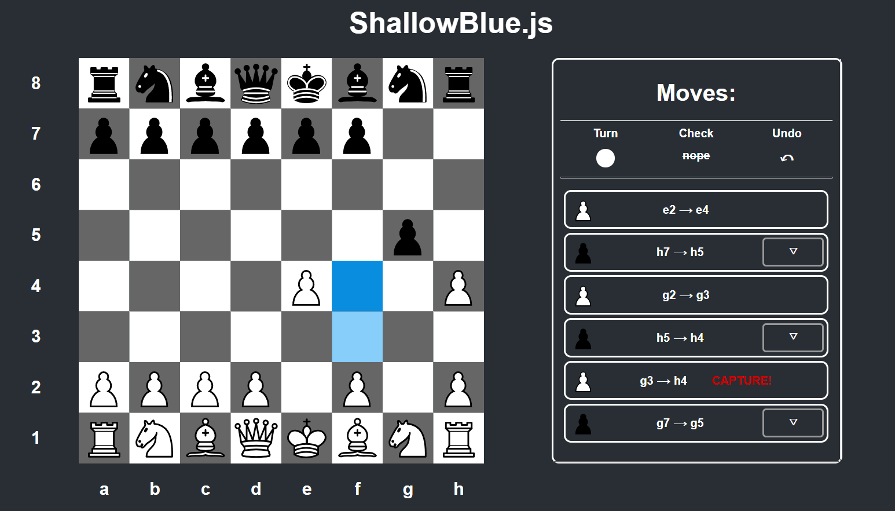

# ShallowBlue.js

Poor, but better looking version of IBM's Deep Blue with minimax, alfa-beta pruning and **soon** reinforcement learning.
**Live version** - https://shallow-blue-js.herokuapp.com/

## Brief description

App lets you play chess with simple AI of various difficulty levels. Better AI means going deeper down the minimax tree.
Chess logic is implemented via Chess.js library and here I focused mainly on board visualization with React, data flow and AI algorithms.



### Installation

After cloning this repository, in the project directory, you have to install dependencies:

```
npm i
```

Then you should run:

```
npm run dev
```

App should be running in your browser at

```
localhost:8080
```

Give it a try!

## Built With

* [React](https://reactjs.org/) - with the newest 16.3 version [Context API](https://reactjs.org/docs/context.html)
* [React Modal](https://github.com/reactjs/react-modal) for modals and [React Collapse](https://github.com/nkbt/react-collapse) for dropdowns
* [React Draggable](https://github.com/mzabriskie/react-draggable) - Most user-friendly React drag n' drop wrapper out there
* [Chess.js](https://github.com/jhlywa/chess.js/blob/master/README.md) - Great chess engine library
* [ESLint](https://eslint.org/) - most popular JS linter with slightly modified [AirBnB rules](https://github.com/airbnb/javascript)
* [Sass](https://sass-lang.com/) - most popular CSS preprocessor
* [Webpack](https://webpack.js.org/) with [Babel](https://babeljs.io/) - bundler and compiler for newest ECMAScript standard

## Further development

* Use [TensorFlow.js](https://js.tensorflow.org/) to make this chess AI really badass.
* Run all computing in Web Workers for better performance.
* Make it with more RWD in mind.
